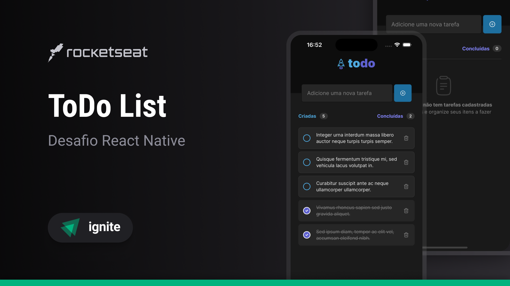

<p align='center'>
  
</p>

<h1 align='center'>
  ToDo List - Praticando os conceitos do React Native
</h1>



Aplicação de controle de tarefas no estilo todo list desenvolvido no primeiro desafio da trilha de React Native do Ignite da Rocketseat.

## ⚙️ Funcionalidades
- Adicionar uma nova tarefa
- Marcar e desmarcar uma tarefa como concluída
- Remover uma tarefa da listagem
- Mostrar o progresso de conclusão das tarefas
- Validar se uma tarefa já existe
- Não permitir criar uma tarefa vazia
- Alerta de confirmação ao remover uma tarefa

## 🛠️ Tecnologias e ferrementas utilizadas

- [TypeScript](https://www.typescriptlang.org/)
- [React Native](https://reactnative.dev/)
- [Expo](https://expo.dev/)
- [React Native SVG](https://github.com/software-mansion/react-native-svg)
- [React Native SVG transformer](https://github.com/kristerkari/react-native-svg-transformer)
- [Lucide React Native](https://lucide.dev/)

## 💻 Instalando e rodando o projeto localmente
#### Requisitos
- Node.js
- Gerenciador de pacotes
- Um dispositivo móvel ou simulador para rodar o aplicativo

```bash
# Passo 1: Clone este repositório
$ git clone https://github.com/welisonw/ignite-rn-desafio01-praticando-conceitos.git


# Passo 2: Acessa a pasta do projeto
$ cd ignite-rn-desafio01-praticando-conceitos


# Passo 3: Instale as dependências
## npm
$ npm install

## yarn
$ yarn install


# Passo 4: Inicie o projeto
## npm
$ npx expo start

## yarn
$ yarn expo start

# Escaneie o QR Code gerado com seu dispositivo móvel ou utilize um simulador para rodar o aplicativo.
```

## 📝 Licença
Esse projeto está sob a licença **MIT**. Veja o arquivo [LICENSE](LICENSE) para mais detalhes.
